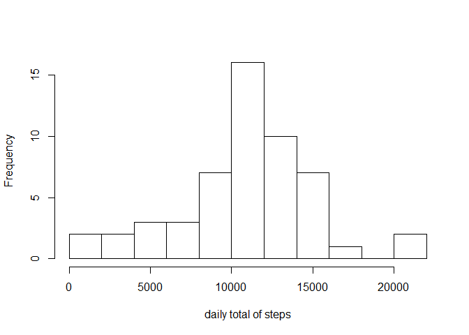

# Reproducible Research: Peer Assessment 1


## Loading and preprocessing the data


```r
setwd(dir='C:/Users/ntpuser3/datascience/Reproducible Research/RepData_PeerAssessment1')
input <- read.csv(file="./activity.csv", header=TRUE,colClasses=c("integer", "Date", "integer"))
str(input)
```

```
## 'data.frame':	17568 obs. of  3 variables:
##  $ steps   : int  NA NA NA NA NA NA NA NA NA NA ...
##  $ date    : Date, format: "2012-10-01" "2012-10-01" ...
##  $ interval: int  0 5 10 15 20 25 30 35 40 45 ...
```

OK, I have all 17 568 observations. Let's start analysing this file.

## What is mean total number of steps taken per day?


```r
steps_by_day <- input %>% group_by(date) %>% summarize(tot_steps=sum(steps))
```


```r
hist(steps_by_day$tot_steps, breaks=10, xlab="daily total of steps", main="")
```

<!-- -->

On most days the total number of steps lies between 10 and 12K.


```r
summary(steps_by_day$tot_steps)
```

```
##    Min. 1st Qu.  Median    Mean 3rd Qu.    Max.    NA's 
##      41    8841   10760   10770   13290   21190       8
```
The mean number of steps by day is 10770. The median is somewhat lower with 10760.


## What is the average daily activity pattern?


```
## -------------------------------------------------------------------------
```

```
## You have loaded plyr after dplyr - this is likely to cause problems.
## If you need functions from both plyr and dplyr, please load plyr first, then dplyr:
## library(plyr); library(dplyr)
```

```
## -------------------------------------------------------------------------
```

```
## 
## Attaching package: 'dplyr'
```

```
## The following objects are masked from 'package:plyr':
## 
##     arrange, count, desc, failwith, id, mutate, rename, summarise,
##     summarize
```

```
## The following objects are masked from 'package:stats':
## 
##     filter, lag
```

```
## The following objects are masked from 'package:base':
## 
##     intersect, setdiff, setequal, union
```


```r
avg_steps_interval <- ddply(input,.(interval),summarise,avg_steps_int=mean(steps,na.rm=TRUE))
with(avg_steps_interval,plot(interval, avg_steps_int, type='l', xlab="Interval", ylab="daily average number of steps",xaxt="n"))
axis(side=1,at=seq(0,2400,by=300))
```

<!-- -->

There is a high peak of steps taken between interval 800 and 900.


```r
maxloc <- which.max(avg_steps_interval$avg_steps_int)
avg_steps_interval[maxloc,1]
```

```
## [1] 835
```

The maximum number of steps is taken at interval 835.


## Imputing missing values

###How many missing values do we have ? 

```r
  sum(is.na(input$steps))
```

```
## [1] 2304
```

There are 2304 missing observations.

###Imputing the missing values with the median for that interval.

```r
 median_int <- input %>% group_by(interval) %>% summarize(medstep=median(steps,na.rm=TRUE)) 
 input_merge <- arrange(join(x=input,y=median_int),by=interval)
```

```
## Joining by: interval
```

```r
 for (i in 1:nrow(input_merge)) {
     if (is.na(input_merge$steps[i])) {
         input_merge$steps[i] <- input_merge$medstep[i]
     }
 }
```


```r
detach("package:plyr",unload=TRUE)
steps_by_day <- input_merge %>% group_by(date) %>% summarize(tot_steps=sum(steps))
hist(steps_by_day$tot_steps, breaks=10, xlab="daily total of steps", main="")
```

<!-- -->

In imputing the missing values with the median for that interval, we see there are far more days with a near-zero number of daily steps


```r
summary(steps_by_day$tot_steps)
```

```
##    Min. 1st Qu.  Median    Mean 3rd Qu.    Max. 
##      41    6778   10400    9504   12810   21190
```

In imputing the missing values with the median for that interval, the mean number of daily steps is lowered to 9504. The impact on the median is smaller, going down from 10760 to 10400. 


## Are there differences in activity patterns between weekdays and weekends?

###Checking what type of day an activity occurs in


```r
weekdag <- c("Monday", "Tuesday", "Wednesday", "Thursday", "Friday")
input_merge <- input_merge %>% mutate(dag=weekdays(date),dagtype="NA")
for (i in 1:nrow(input)) {
    if (input_merge$dag[i] %in% weekdag) {
        input_merge$dagtype[i]="weekday"
    }
    else {
        input_merge$dagtype[i]="weekend"
    } 
}
input_merge$dagtype <- as.factor(input_merge$dagtype)
```

###Creating a panel plot comparing the average daily steps by weekdays vs weekend days


```r
meansteps <- input_merge %>% group_by(dagtype,interval) %>% summarize(meansteps=mean(steps)) 
library(lattice)
xyplot(meansteps ~interval|dagtype,meansteps,type="l", layout=c(1,2), xlab="Interval", ylab="Number of steps")
```

<!-- -->

During weekends it takes longer before one gets active, but there is on average a higher activity during the day than in weekdays.
